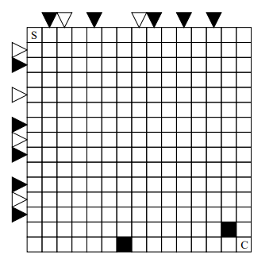

# Ágyújáték

Jussunk el a tábla bal felső sarkába helyezett figurával a jobb alsó sarokba!
A figura függőlegesen és vízszintesen mozoghat, minden lépésben egy mezőnyit.
A sorok fölött és az oszlopok mellett elhelyezett háromszögek ágyúkat jelölnek, amelyek lézersugarakat bocsájtanak ki.
Ha egy ágyú aktív, akkor a megfelelő sorban illetve oszlopban nem állhat a figura.
Kezdetben a világos háromszögekkel jelölt ágyúk aktívak, ezt követően lépésenként felváltva aktívak a világos és sötét háromszögekkel jelöltek.
A figura nem léphet a sötét mezőkre sem.

